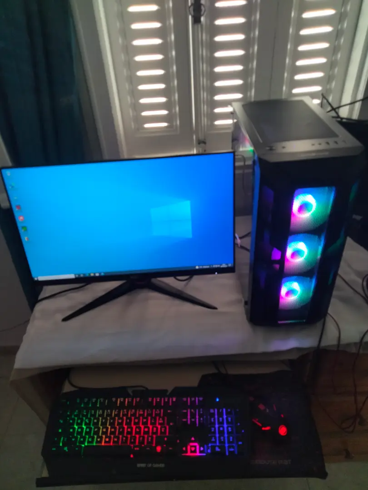
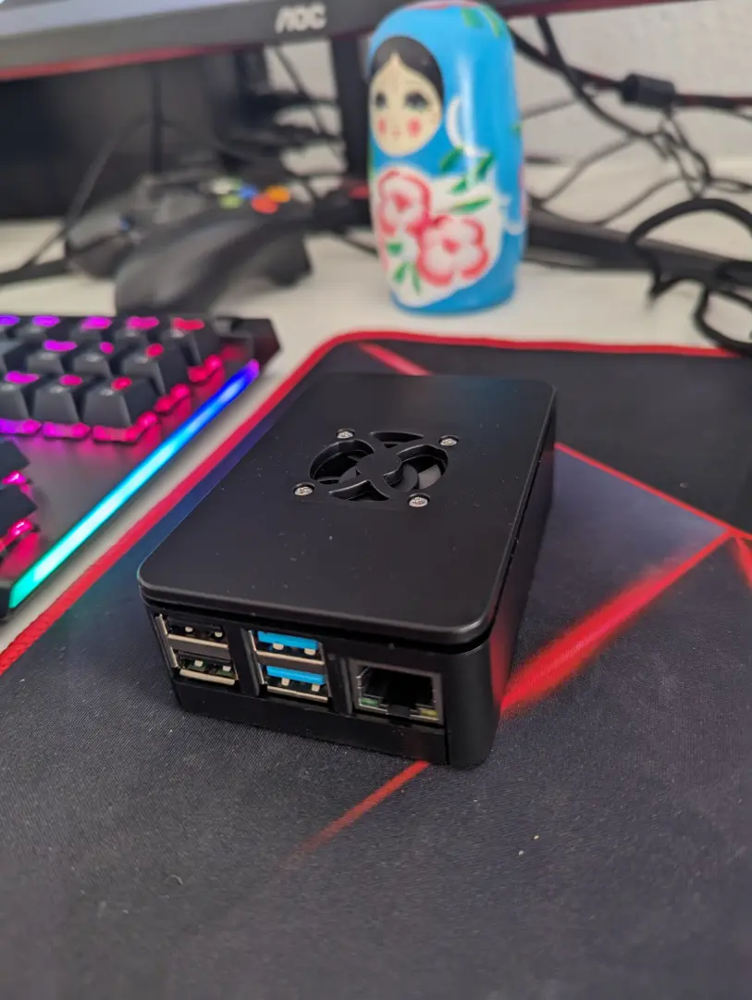
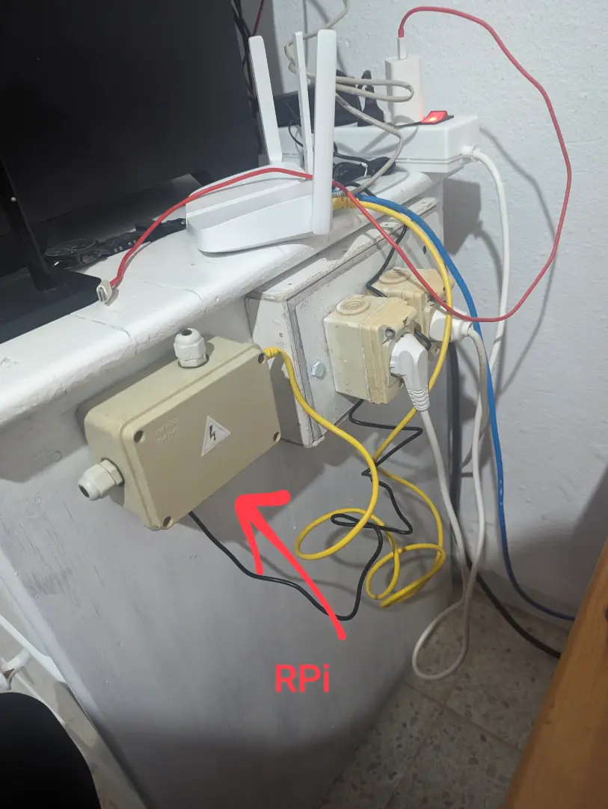
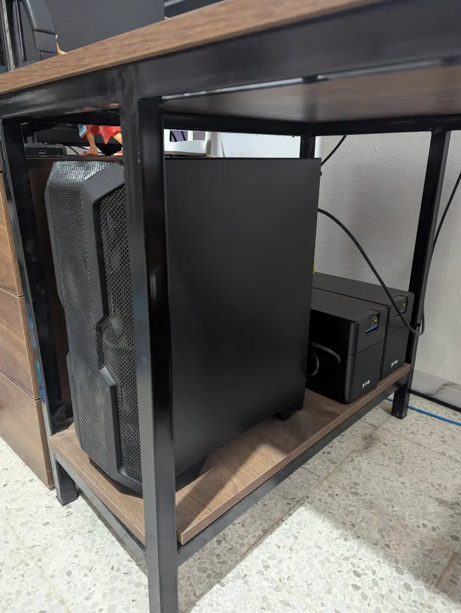
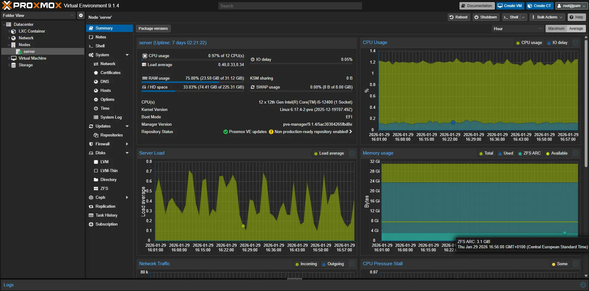

I made the full switch into Linux in 2023 since I started following YouTubers like [Luke Smith](https://www.youtube.com/@LukeSmithxyz) and [Mental Outlaw](https://www.youtube.com/MentalOutlaw) to name a few and then got into the rabbit hole of self-hosting on a budget therefore it is safe for me to say that I am somewhat experienced in this practice so I will walk you in this post on my setups over those 3 years, what I learned and what are my plans for the future.

## Linux As My Main OS

Back then I only had a desktop that I bought the year before and was using Windows 10 on it for gaming and work since at that time I was working with Microsoft software. Here are its specs (the only thing that remained till now is the GPU and case as I replaced everything else):

- Intel Core i5 10400.
- 16 GB DDR4 RAM.
- NVIDIA GeForce RTX 3050 8GB VRAM.
- 1 TB NVMe.

Here is a picture of my desktop where I first bought it (apologies for the image quality):

For me the main reason for making the switch to Linux is that I wanted to learn it hands on and dedicate my computer for software development, I started out with Debian 11 as my first distro.
I wasn't doing too much gaming but I came up with a solution for some of the games I was playing with friends that had Anti-Cheat and that was a VM with GPU passthrough thanks to QEMU/KVM which was built in and allowed me to have a config in such a way that Windows and the Anti-Cheat software can't figure that they are running in a VM.

Here are guides I used back in 2024 when I updated my VM to use Windows 11 through Qemu/KVM and GPU Passthrough:

- [Installing KVM And QEMU](https://sysguides.com/install-kvm-on-linux)
- [Installing Windows 11 On VMs](https://sysguides.com/install-a-windows-11-virtual-machine-on-kvm)

Other reasons that are still as important are ownership and privacy: I get to use my OS without having to have an account tied to the developers and customize it to my heart's content all with minimal resource consumption. There are still issues with driver and software compatibility but it is getting better in the recent years thanks to projects like [Wine](https://www.winehq.org/) and [Proton](https://github.com/ValveSoftware/Proton).

## Self-Hosting

Previously, I had my website deployed on Vercel since back then I made it using Next.js but as I got deeper into the optimization meme I recreated my website in [Hugo](https://gohugo.io/) which worked out pretty well and I am now more satisfied with its performance. Naturally, since I migrated away from Next.js I decided to get my own VPS and deploy the website there. I would say I got an overpowered one for my uses but I gained the capability to have more stuff in there like some of my personal projects and my own email through open source tools (check Luke Smith's [emailwiz](https://github.com/LukeSmithxyz/emailwiz) repo). Here is the VPS specs which I got from Hostinger through a YouTuber's affiliate link:

- AMD EPYC 9354P 8 Cores.
- 32 GB DDR4 RAM.
- 400 GB NVMe.
- 32 TB Bandwidth.

Having to manage a server comes with learning more tools related to System Administration like Nginx, Certbot, GitHub Actions, Systemd services, setting up SSH and firewall rules, blocking unwanted traffic through [Crowdsec](https://github.com/crowdsecurity/crowdsec). This made me get a better hands on understanding on how different components work in Linux since nothing is abstracted away like it was with Vercel and had to configure almost everything by hand. Here are some guides that helped me setup my website on my VPS:

- [VPS Setup And Website Deployment](https://www.youtube.com/watch?v=DmbBgXK8M5M)
- [Based Website Analytics Written In C](https://curiouscoding.nl/posts/goaccess-setup/)

And here is a sneak peek at my latest analytics stats:



## My Home Server

The next thing I did was to get some sort of personal cloud that is hosted locally mainly to sync and backup files between my devices and block ads in my local network. For that I started out with a Raspberry Pi 4 that had 8 GB of RAM in which I connected a 500 GB SSD external drive and for cooling I got heatsinks and a cpu fan and kept it running 24/7 and it worked surprisingly well for a good amount of time. I used [Syncthing](https://syncthing.net/) for file synchronization and [PiHole](https://pi-hole.net/) as my local network DNS server to block unwanted incoming traffic. Here are pictures of my Raspberry Pi and how I mounted it to my old desk in 2024:

Then in 2025 I got a new desktop so I used the old one as my home server. I upgraded the RAM to 32 GB and the CPU to an i5 12400 and got an SSD on which I installed [Proxmox VE](https://pve.proxmox.com/wiki/Main_Page). Thanks to the [community scripts](https://community-scripts.github.io/ProxmoxVE/) I was able to get the stuff I had on the Pi migrated to my home server with ease into separate LXCs and VMs. I also added the ability to connect to my home server remotely through VPN using [Wireguard](https://www.wireguard.com/) and since my ip at home is dynamic I registered a subdomain as a DDNS record and used [ddclient](https://ddclient.net/) on the server to automatically send the new ip every time it changes. Here are some guides I used to configure PCIe passthrough both to VMs and LXCs to pass my GPU for better performance:

- [Proxmox PCIe Passthrough](https://www.youtube.com/watch?v=_hOBAGKLQkI)
- [Proxmox LXC GPU Passthrough Written Guide](https://digitalspaceport.com/proxmox-lxc-docker-gpu-passthrough-setup-guide/)

Here is my home server running 24/7 and connected to a UPS to stay up for a while in case of a power outage (the other UPS is connected to other devices like the router):

And here is its proxmox dashboard from where I can access LXCs and VMs or monitor and manage resources:

## Next Steps

Getting into Linux and self-hosting made me better at system administration and got me excited and hopeful about having as much autonomy as possible with the tools I use especially with the current times where almost every commercial software dedicated to normal consumers hoards and sells data to be used for ads even in paid products. Although it is not for everyone since it involves a lot of configuration which requires patience but for me it is so I will continue to incoporate free and open source tools into my "personal cloud" to keep learning as a software engineer and to keep control of my digital footprint.

One step I recently took in that direction is installing my own search engine using [SearXNG](https://docs.searxng.org/) on my VPS which I can use on all of my devices. Other steps I plan to take is to get into more Linux distros (I tried debian based, Arch and Nix) and most importantly contribute back to the open source tools in any way I can whether financially or through assistance in development.
