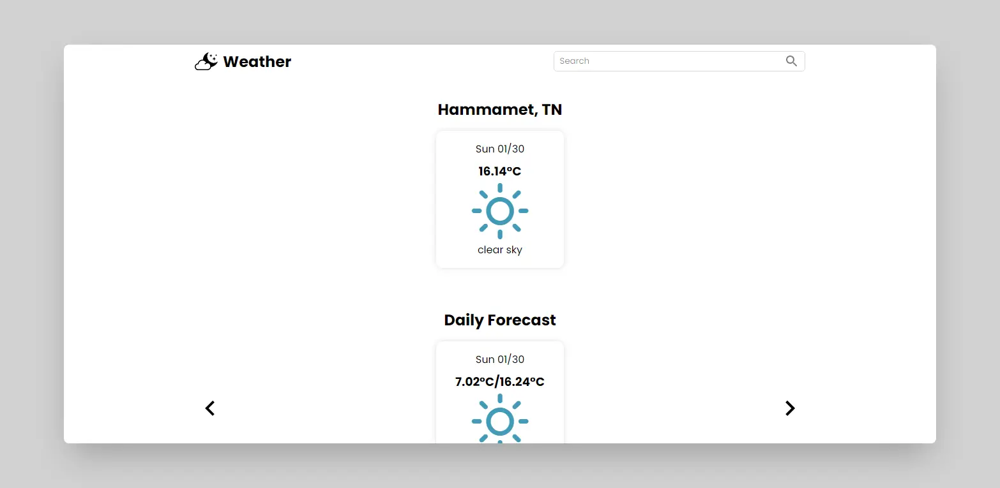

## About the project

This is a project that I made as a step in the interview process for my final year internship. Here you can find its [source code](https://github.com/hazemKrimi/react-weather-app) or you can view the [demo](https://hazemkrimi.github.io/react-weather-app).

The features are fetching the weather depending on the device's location or by using the search bar on the top right of the app. The weather data it fetches are the daily forecast, weekly forcast and today's wind and humidity.

## Technologies

- React
- TypeScript
- Styled Components
- OpenWeatherMap API

## Screenshots

